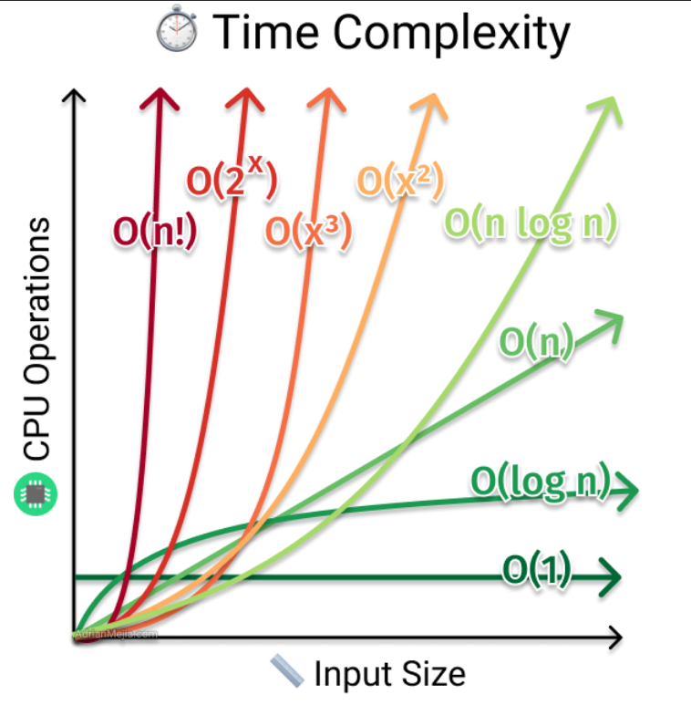

# Data Structures

- A **Data Structure** is a collection of data values, the relationships among them, and the functions or operations that can be applied to the data.
- The functions available in each data structure offer certain benefits in regard to [time/space complexity](#complexity-analysis)

## Complexity Analysis

- **Complexity Analysis** is the process of determining how efficient an algorithm is. Usually involves finding both the time complexity and space complexity of an algorithm
- **Big O** - Worst case scenario in regards of time and space to solve task
  - **Time Complexity**
    - A measure of how fast a problem runs
  - **Space Complexity**
    - How much memory a problem takes up while running

## Memory

- **Bit**
  - Short for `binary digit`, a bit is a fundamental unit of information in Computer Science that represents a state with one of two values, typically `1` or `0`. Any and all data stored on a computer, at it's most basic level, is represented in `bits`
- **Byte**
  - A group of eight `bits`. (01101000) is one `byte`
  - A single byte can represent up to `256` data values (2⁸)
  - Since a binary number is a number expressed with two symbols, like `1` and `0`, a byte can effectively represent all of the numbers between `0` and `255` inclusive, in binary format
  - The follow bytes represent the numbers `1`, `2`, `3`, and `4` in binary format:
    - `00000001`
    - `00000010`
    - `00000011`
    - `00000100`
- **Fixed-Width Integer**
  - An integer represented by a fixed amount in `bits`. For example, a **32-bit integer** is an integer represented by 32 bits (4 bytes), and a **64-bit integer** is an integer represented by 64 bits (8 bytes)
  - The following represents the 32-bit representation of the number 1:
    - `00000000 00000000 00000000 00000001`
  - The following represents the 64-bit representation of the number 10:
    - `00000000 00000000 00000000 00000000 00000000 00000000 00000000 00001010`
  - Regardless of how large an integer is, an operation performed on it's fixed-width-integer representation consists of a constant number of bit manipulations, since the integer is made up of a fixed number of bits
- **Memory**
  - The foundational layer of computing where all data is stored
  - Data stored in memory is stored in bytes, and by extension, bits
  - Bytes in memory can **"point"** to other bytes in memory, so as to store references to other data
  - The amount of memory that a machine has is bounded, making it valuable to limit how much memory an algorithm takes up
  - Accessing a byte or a fixed number of bytes (like 4 bytes or 8 bytes in the case of 32-bit and 64-bit integers) is an elementary operation, which can be loosely treated as a single unit of operational work
  - Data is stored **contigously**, enough space must be available with _nothing in between_ to store the data necessary to represent what we want

## Big O Notation

- Used to describe the time and space complexity of algorithms
- Variables used in Big O notation denote the sizes of the inputs to algorithms.
  - For example, `O(n)` might be the time complexity of an algorithm that traverses through an array of length `n`
  - Similary, `O(n + m)` might be the time complexity of an algorithm that traverses through an array of length `n` and through a string of length `m`
- **Common Complexities (fastest to slowest)**
  - Constant: O(1)
  - Logarithmic: O(log(n))
  - Linear: O(n)
  - Log-Linear: O(nlog(n))
  - Quadratic: O(n²)
  - Cubic: O(n³)
  - Exponential O(2ⁿ)
  - Factorial O(n!)
    
- Big O describes the **worst-case** complexity of an algorithm, even though the worst-case complexity might differ from an **average-case** complexity
- For example, some sorting algorithms have different time complexities depending on the layout of the elements in their input array. In rare cases, their time complexity will be much worse than in more common cases. Similarly, an algorithm that takes in a string and performs special operations on uppercase characters might have a different time complexity when run on an input string of only uppercase characters vs an input string with just a few uppercase characters
- It is worthwhile to consider average-case and worst-case scenarios
